# comp2026 system diagram

## Current scope

This document describes the operating contracts in the current checkout. The
QGC receiver, immutable command admission, ACK transport, telemetry startup,
runtime validation, single synchronous execution owner, live factory, and
conservative cleanup reporting are accepted software interfaces. Parent range,
camera, guarded payload, packaging, and early legacy-entry quarantine work is
also accepted. The guarded parent QGC host now exists in
`companion/src/drone_sim_companion/runtime_node.py` and has source and offline
test evidence only. The recorded image and isolated non-flight SITL failure
predate that current composition. A matching image, integrated QGC/SITL run,
Ubuntu 22.04 target and platform lock, bench, hardware, and staged flight gates
remain open. There is no supported aircraft shell invocation yet.

## System and ownership

```mermaid
flowchart LR
    operator[Operator] --> qgc[QGroundControl<br/>generated attempt actions]
    qgc -->|COMMAND_LONG| link[Configured MAVLink route]
    link --> rx[QGC receiver<br/>identity and parameter checks]
    rx --> envelope[Immutable CommandEnvelope]
    envelope --> admission[MissionSupervisor<br/>admission and attempt ledger]
    admission --> queue[(Unbounded envelope queue)]
    queue --> executor[Single synchronous<br/>execution owner]
    executor --> mission[FM1 / FM2 / enabled FM3]
    mission --> guard[Guarded DroneControl<br/>permission plus fresh evidence]
    guard --> fc[Flight controller]
    rx -->|admission and status ACKs| qgc
    executor -->|terminal ACK| qgc

    fc --> telemetry[Source-filtered<br/>telemetry callbacks]
    telemetry --> observations[FC observations]
    camera[Camera worker] --> sensor_evidence[Immutable sensor samples]
    lidar[LiDAR worker] --> sensor_evidence
    observations --> state[FlightState<br/>authority and freshness]
    sensor_evidence --> mission
    sensor_evidence --> guard
    state --> admission
    state --> guard

    payload[Payload adapter] -->|permission checked output| physical[Payload hardware]
    mission --> payload
    state --> payload
```



The receiver and sensor workers only publish observations or envelopes. They do
not send navigation or payload commands. The execution owner is the sole mission
and recovery writer. A QGC ACK reports command handling; it is not flight
authority and does not prove motion, landing, release, attachment, or score.

## Attempt preparation and startup order

The operator creates attempt files offline:

```bash
PYTHONPATH=src python src/gc/prepare_attempt.py \
  initialize-ledger /durable/operator/attempt-ledger.json

PYTHONPATH=src python src/gc/prepare_attempt.py prepare \
  --profile /operator/deployment-profile.json \
  --ledger /durable/operator/attempt-ledger.json \
  --session /operator/current-attempt-session.json \
  --actions /operator/current-qgc-actions.json \
  --acknowledge-on-ground
```

The generated QGC action file and session bind the verified profile, raw profile
hash, action hash, generation, identities, releases, wire protocol, and current
durable attempt token. Canonical zero-token actions are not flight inputs.

The caller and live runtime follow this order:

1. A simulation host enters its caller-owned
   `drone.timebase.configured(clock)` scope before construction and keeps it
   active through `run()`, recovery, and `close()`. The factory does not enter
   this scope. Without it, the runtime uses the host monotonic clock.
2. `construct_after_full_validation` validates the deployment profile, prepared
   session, generated actions, current
   unconsumed ledger, waypoint store, operating-site checks, runtime limits, and
   enabled phase set before opening any transport or device.
3. `build_live_listener` binds components before importing or calling a hardware
   factory. No explicit factories requires `HardwareComponentConfig` and the
   fixed `physical-hardware-v1` backend. Explicit `LiveComponentFactories`
   requires `InjectedComponentConfig` with the exact same validated backend
   label. An injected binding contains an evidence reference, not physical GPIO
   pins or raw I2C range limits. These labels identify an adapter composition;
   they do not establish flight approval or device validity.
4. `build_live_listener` constructs the flight state and decoders, supervisor,
   guarded controller, and ACK transport in that order. The default and physical
   path still requests the configured telemetry and firmware messages, checks
   command ACKs, and confirms distinct fresh arrivals before QGC listener
   installation. The only staged exception is an explicit injected
   `drone-sim-ros-confirmed-v1` FM1/FM2 composition. It installs the
   source-filtered collector and proves interval ACKs plus firmware metadata
   before listener readiness, but waits for telemetry cadence until after the
   admitted FM1's first guarded GUIDED delivery releases paused Gazebo. The
   controller then requires fresh, complete, strictly increasing post-gate
   samples on advancing shared simulation time before ARM or TAKEOFF output.
   Timestamp-zero, pre-gate, and wrong-source samples cannot satisfy the gate.
   No path advances or fabricates simulation time. Construction then adds LiDAR
   and the deferred payload. For enabled FM3 it starts bounded camera
   acquisition and requires current precision readiness before listener
   installation.
5. The factory installs the QGC callbacks and returns the runtime. Installation
   performs no flight action by itself. A host-supplied synchronous, nonblocking
   `startup_admission_check` runs first in admission and must return `None`.
   The host can keep it closed while publishing durable readiness. A supplied
   `on_listener_ready` runs once after installation and before `run()`; failure
   attempts cleanup without starting the owner. A simultaneous cleanup failure
   is chained to, and does not replace, the original readiness failure. Hosts
   that need this ordering must provide both hooks. A host that owns process
   signals also passes `manage_signals=False`; standalone physical use keeps the
   listener's SIGINT handling. The default standalone path provides neither
   hook. These lifecycle hooks do not replace telemetry, firmware,
   authority, site, RC, or phase checks. If no explicit FM1 packet enters during
   installation, the
   attempt remains unconsumed, authority and H remain unset, and the payload
   delegate remains uninitialized. A callback can run as soon as it is
   installed, including before factory return.
6. An explicit FM1 packet can reach admission through the installed callback
   even if `run()` has not started. Admission checks the
   fresh, source-filtered, disarmed, exact `ON_GROUND`, no-failsafe snapshot and
   the operating site. It then consumes the token, acquires initial companion
   authority, pins H from that snapshot, initializes the payload delegate, and
   queues the immutable FM1 envelope.
7. `run()` starts the synchronous owner, which waits for and executes admitted
   envelopes. Starting `run()` does not grant callback authority or perform FM1
   admission. It does not start the legacy automatic route.
8. On abort or failure, latch the reason, forbid ordinary outputs, unwind the
   mission deadline, and call the supervisor's one recovery method while the
   clock and required observations remain available.
9. After `PILOT` or `UNCONFIRMED` recovery, retain command-silent observation
   ownership. Natural exit requires new trusted fresh exact `ON_GROUND` and
   disarmed observations after the terminal boundary. A terminal SIGINT or
   `stop_monitoring()` requests only an explicit unconfirmed monitoring stop;
   an active-phase SIGINT still requests abort and recovery.
10. Stop camera and range workers, wait for recording work within its budget,
   close the vehicle, and report observed shutdown status. A blocked native read
   or cleanup can remain unconfirmed.

The review-clean factory implements its portions of this sequence. The caller
owns the clock scope, and explicit FM1 admission owns authority acquisition and
H pinning. Deployment profiles still need verified aircraft values. The parent
`comp2026_auto` entry now adopts this guarded composition for the FM1/FM2
simulator path, with source and offline test evidence only.

## Command and result sequence

The receiver rejects foreign identities, malformed parameters, and
`COMMAND_INT`. It asks the supervisor to reserve a valid immutable envelope
before enqueueing it or reporting admission status. The execution owner dequeues
one complete envelope, marks it running, executes one phase through guarded
controller calls, records the terminal result, and reports terminal status.

For a valid duplicate, the receiver reports the existing queued, running, or
terminal result without re-enqueueing, recapturing H, rerunning prerequisites, or
consuming the ledger. The abort action 31015 latches cooperative cancellation
without joining the queue. A new explicit command is required for each phase.

Live flight requires MAVLink 2. COMMAND_ACK packets must carry the configured
companion target and come from the pinned flight controller; MAVLink 1 profiles
fail before hardware construction. GUIDED `MISSION_ITEM_INT current=2` output is
serialized until a post-enqueue `MISSION_ACK` matches the flight-controller
source, companion target, and mission type. ACK acceptance never replaces flight
state confirmation. `MISSION_ACK` has no per-transaction nonce: a sufficiently
delayed ACK can be indistinguishable from a later `MISSION_ITEM_INT current=2`
transaction, so timeout, rejection, or interruption latches out every later
`current=2` output. Recovery can choose a separately authorized local LAND from
fresh state, but it does not retry the ambiguous mission item. The [MAVLink command protocol](https://mavlink.io/en/services/command.html)
defines admission, progress, and terminal results. The exact fields are in the
[MAVLink common message set](https://mavlink.io/en/messages/common).

## Component responsibilities

| Component | Responsibility | Primary source |
| --- | --- | --- |
| Offline attempt preparation | Validate the deployment profile and ledger, then write bound session and QGC action files | [`src/gc/prepare_attempt.py`](../src/gc/prepare_attempt.py), [`attempt_setup.py`](../src/drone/control/attempt_setup.py) |
| QGC receiver | Decode identity-matched `COMMAND_LONG`, reject `COMMAND_INT`, admit before ACK, and preserve duplicates | [`listener.py`](../src/drone/control/listener.py) |
| Execution owner | Execute one complete envelope, maintain the 600-second attempt deadline, send terminal status, and claim recovery once | [`listener.py`](../src/drone/control/listener.py) |
| MissionSupervisor | Enforce phase order, durable token consumption, abort, terminal result, permission, and one recovery outcome | [`mission_supervisor.py`](../src/drone/control/mission_supervisor.py) |
| FlightState | Store source-filtered observations and own `UNKNOWN`, `COMPANION`, `PILOT`, and `FC_FAILSAFE` authority | [`flight_state.py`](../src/drone/control/flight_state.py) |
| DroneControl | Recheck permission at output boundaries and require command ACK plus post-command state evidence | [`drone_control.py`](../src/drone/control/drone_control.py) |
| Waypoint store | Bind one absolute path per tracker and produce immutable attempt snapshots | [`mission_info.py`](../src/drone/control/mission_info.py) |
| Precision mission | Require fresh camera, attitude, location, and calibrated range evidence for FM3 | [`mock_mission.py`](../src/drone/mock_mission.py) |
| LiDAR worker | Publish immutable samples and invalidation generations; report bounded shutdown truthfully | [`lidar.py`](../src/drone/sensors/lidar/lidar.py), [`clearance.py`](../src/drone/sensors/lidar/clearance.py) |
| Physical Dropper | Check live permission around GPIO output and release; advertise no attachment capability | [`servo.py`](../src/drone/sensors/servo/servo.py) |

The settled entry point is
`start_repl(files, runtime_config, *, factories=None, diagnostics=None,
monitoring_stop=None) -> LiveRunResult`.
It composes through
`construct_after_full_validation(files, runtime_config, *, component_factory)`
and `build_live_listener(artifacts, config, *, factories=None, diagnostics=None,
monitoring_stop=None) -> LiveListenerRuntime`. `LiveRunResult` keeps mission,
recovery, monitoring-exit, and cleanup outcomes separate. The live configuration caps the
attempt budget at 600 seconds and accepts only stable `ArduCopter 4.5.7` with
packed version `0x040507FF`, exact eight-byte custom-version evidence, and an
explicit evidence reference. This is a software compatibility decision, not
proof that the installed aircraft runs that release. The signatures require
validated objects and are not aircraft shell commands.

## Command map and phase flow

| ID | Meaning | Notes |
| ---: | --- | --- |
| 31000 | FM1 | Consumes the prepared token and starts the attempt deadline on execution. |
| 31001 | FM2 | Admitted only after FM1 succeeds. |
| 31002 | FM3 | Admitted only after FM2 succeeds and when FM3 is enabled. |
| 31003 | Update WA | Pre-attempt coordinate mutation. |
| 31004-31009 | Update WM1-WM6 | Pre-attempt coordinate mutation. |
| 31010 | Update L | Pre-attempt coordinate mutation. |
| 31011 | Update TARGET | Pre-attempt coordinate mutation. |
| 31012 | Clear pickup waypoints | Clears `WA` and `WM1` through `WM6`. |
| 31013 | Clear all waypoints | Clears the complete waypoint set. |
| 31014 | Retired | Unsupported and absent from generated actions. |
| 31015 | Abort and recover | Generated only with verified collision evidence; bypasses the queue. |

FM1 takes off to the configured cruise height relative to H, transits to L,
commands LAND, confirms touchdown, and confirms disarm. FM2 requires release
configuration before movement, takes off, transits to TARGET, corrects its
waypoint from calibrated projected clearance, holds with continuous coherent
evidence, and attempts release. FM2 does not claim physical release from the
payload call alone.

FM3 requires explicit attachment capability plus verified camera and precision
configuration. It confirms precision touchdown and disarm before requesting
attachment, then repeats guarded takeoff, transit, hold, and release work. The
physical `Dropper` has no attachment mechanism, so hardware FM3 is disabled.
Absent FM3-only vision inputs do not block FM1, FM2, or independently approved
LAND recovery.

## Coordinate and sensor model

Original H survives rearming. `get_current_gps()` and mission-flight
`GPSCoord.alt` values are relative to H; global vehicle commands are AMSL. The
current FC home may change after a new arm, but it only affects takeoff
translation after fresh `HOME_POSITION` proof.

QGC setup captures `GLOBAL_POSITION_INT.relative_alt` before H is pinned. Its
stored altitude is historical FC-home-relative metadata, not an original-H or
AMSL flight target. Horizontal site checks may use stored latitude and
longitude, but not this altitude as vertical evidence. Every active phase
replaces setup altitude before horizontal transit. FM1 and FM2 use their
configured cruise height. FM3 creates fresh pickup and delivery coordinates
from stored latitude and longitude plus its precision-policy cruise height, and
uses the fresh delivery coordinate for clearance correction. It does not mutate
the inputs, migrate the store, or infer a datum conversion.

LiDAR validity includes source time, sequence, invalidation generation, range
limits, age, range-attitude skew, beam direction, measured reference offset,
tilt, and explicit horizontal-planar applicability. Camera precision uses
exposure time plus bounded attitude and location transport-latency intervals.
One common calibration and one clock domain must reach every consumer. Simulator
facts cannot verify aircraft mounting, buffering, GPIO, or physical attachment.

## Authority and recovery

`UNKNOWN` is never relabeled `PILOT` without a fresh healthy RC switch edge and
accepted pilot mode. Independent flight-controller actions keep precedence. The
supervisor does not restore GUIDED or rearm during recovery. A recovered landing
does not change a failed mission result into success.

Each flight message enters a short output transaction. Dependency, vital
evidence, FlightState permission, operation evidence, and supervisor
abort/deadline are rechecked after packing at DroneKit's actual writer queue
boundary. Takeoff also binds its packed FC-relative altitude to the HOME datum
validated by that transaction. The writer wrapper preserves DroneKit's encoder,
signing, sequence, counters, callbacks, and queue.

Evidence-only release handover, actual GPIO actuation, and MAVLink enqueue are
separate boundaries. Only MAVLink output requires a writer receipt. Every real
servo release output revalidates the current range and stability boundary
against the consumed one-use confirmation. A later channel cannot release
after that evidence becomes invalid. Return-to-mid neutralization remains an
authority-guarded continuation output. After a refused or failed release, each
neutral position is attempted once while authority remains current; an
authority-loss denial stops later attempts. These attempts prove neither a
physical neutral position nor a physical payload release. Permission-only
check-then-output is rejected.

## Other entry points

These files are development tools, not the production QGC path:

- [`src/gc/main.py`](../src/gc/main.py) is an explicitly invoked payload command
  test and needs its configured test endpoint and identity.
- [`src/drone/control/sender.py`](../src/drone/control/sender.py) is a synthetic
  `STATUSTEXT` sender.
- [`src/drone/sitl/simulation.py`](../src/drone/sitl/simulation.py) is an explicit
  SITL exercise. Its relaxed checks do not apply to aircraft operation.
- [`src/cam_test.py`](../src/cam_test.py) and
  [`src/lidar_test.py`](../src/lidar_test.py) are explicit hardware diagnostics.
- [`src/drone/entry.py`](../src/drone/entry.py),
  [`src/drone/waypoint_only.py`](../src/drone/waypoint_only.py), and
  [`src/drone/aruco_land_only.py`](../src/drone/aruco_land_only.py) are guarded
  legacy or hardware experiments and are not production entry points.
- [`src/drone/missions/fm3.py`](../src/drone/missions/fm3.py) is inactive. The
  guarded FM3 logic is in [`mock_mission.py`](../src/drone/mock_mission.py).
- `src/backup/` contains unintegrated camera and video experiments.

Importing these modules must not open transports, change camera settings, or
start flight or actuator output.

## Open integration and verification gates

The deployment facts, independent failsafe, and operating-area evidence tables
are maintained in the [README](../README.md#deployment-evidence-gates). The
reviewed live factory binds the current contracts without the old integer queue,
hardcoded identities, automatic phase route, or duplicate recovery writer. The
parent guarded QGC host now adopts this path for the FM1/FM2 simulator
composition. Its matching image and integrated QGC/SITL verification remain
open.

The historical `final-fix-head` nested suite passed 928 tests in 14.08 seconds
with no exclusions. The reviewed `residual-corrections-head` snapshot passed
935 tests in 13.75 seconds in the independent review run and 14.19 seconds in
its implementation run. The accepted `residual-fix1-head` software checkpoint
passed 939 tests in 15.51 seconds in its implementation run and 14.92 seconds
in the canonical verification run. Its scoped review accepted
R1-R5 with no new breakage. The historical precision and complete-path subset
passed 75 tests in 6.56 seconds. It checks zero, negative, and large captured
FM3 altitudes without input mutation. The public-factory trace captures -6 m
and 4000 m, then requires both FM3 transit commands at 260 m AMSL from original
H at 250 m and policy cruise at 10 m. It retains the explicit
FM1/FM2/active-FM3 callbacks, stale-authority
`DENIED`, changed FC-home rearms, guarded HOME request/ACK/later-response order,
final original-H navigation, LAND, disarm, idle-abort recovery, and unchanged
600-second deadline through FM2.

The typed physical/injected component binding changes source after that accepted
939-test checkpoint. The canonical local suite for this newer source passed 947
tests in 19.95 seconds. That result is not a review or rebuilt-image result.
Parent composition and source/image evidence were pending at that checkpoint.
The parent composition now exists in source and is offline-tested, but matching
current image and integrated QGC/SITL evidence remain pending.

The Task 5c runtime, bounded Task 11 trace, FM3 altitude,
operating-documentation, and whole-change reviews are historical completed
reviews for `final-fix-head`. The scoped `residual-fix1-head` review is also
accepted as software evidence only. Parent range, camera, guarded payload,
packaging, and early legacy-entry quarantine changes are accepted. The full
parent companion suite passed 165 tests in 2.96 seconds. The obsolete
`comp2026_auto` entry rejected before external construction at that historical
checkpoint, when the guarded parent QGC host was still absent. The current host
supersedes that quarantine in source. No result above proves the QGroundControl
application path, aircraft AMSL behavior, sensors, or physical payload state.

Before this work resumed, the Docker daemon was unavailable, no SITL binary was
present, and parent runtime/allowlist inputs were outside the task's writable
scope. Those are historical constraints. The resumed parent work built the
source and corrected companion image
`sha256:907d481abadfb4a4f54c7a5ea4597ab9ae58a4b24a8c39a0efab2e550812c9fe`.
Its inert, network-disabled inspection matched all 44 expected
source/configuration hashes, found no waypoint store, and confirmed early
quarantine.

The isolated non-flight r2 lane ran native ArduCopter 4.5.7 on a private MAVLink
network. It observed packed version `0x040507FF` and custom-version bytes hex
`3261336463346237`, then failed telemetry validation with `requested telemetry
cadence was not achieved`. The retained result does not identify a particular
failed stream. The handler and owner each processed zero commands, and no test,
mission, flight, or payload command ran. Both owned containers and the private
network were removed, logs were retained, and unrelated services were unchanged.
This does not verify the QGroundControl application or the current parent host.

The aircraft OS/architecture dependency lock remains unresolved, and a parseable
`requirements-hardware.in` is not a verified aircraft lock. The exact aircraft
build, Ubuntu 22.04 target, architecture, platform lock, matching current image,
integrated QGC/SITL flight/fault matrix, physical gates, and staged flight
checks remain closed.
Hardware FM3 remains disabled. Record software, image provenance and inert
smoke, SITL, propellers-removed bench, and staged flight evidence separately.
Owned native cleanup may remain unconfirmed after a bounded stop, so shutdown
reports preserve worker and cleanup status instead of claiming success. The
runtime never calls raw servo cleanup as a passive operation. The physical
Dropper has no verified passive-cleanup hook, so its cleanup is suppressed and
`payload_closed` remains false. A provided passive hook that fails or exceeds
the bound also reports incomplete cleanup. This contract does not establish how
physical payload hardware should be released.
