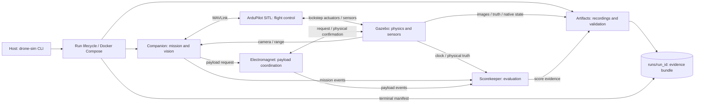

# Architecture and code map

[Start here](../README.md) · [Runbook](runbook.md) · [Current status](handoff.md)

## The system in one picture

This is a responsibility map, not an exhaustive ROS topic diagram. The physical
runtime uses seven services from [compose.yaml](../compose.yaml). `phase3` means
the real Gazebo/SITL stack here, including the mission and scorer; it does not
mean that flight control is still unimplemented. `phase2` uses synthetic peers
to exercise lifecycle and recording infrastructure.

## Follow one run

1. The host CLI resolves a template, assigns a run ID, records configuration and
   source provenance, and starts prebuilt images in an isolated Compose project.
2. Runtime processes establish actual endpoint readiness. Gazebo/SITL perform
   private warmup before the public simulation epoch is released. Public time
   starts at zero; warmup is not a payload mission phase.
3. The companion selects an existing mission or the configured operation runner.
   Camera/range data enters through the host adapter; vehicle commands go through
   MAVLink. Configured diagnostics do not invoke the bundled Comp2026 missions.
4. ArduPilot executes flight control; Gazebo determines movement and payload
   attachment. A mission command or an accepted service request is not proof of
   a physical pickup. Inspect payload height, attachment, release, and settlement.
5. The scorer reads events and physical states. Artifacts records evidence.
   Flight completion, score, and complete/valid artifacts are separate outcomes.
6. At finalization, publishers stop, recorders drain and close, and the host
   validates and commits `manifest.json`. Its terminal state is the run result.

Gazebo owns simulation time. Wall-clock deadlines detect infrastructure stalls;
they do not advance the mission. The public camera/state grid is 50 ms (20 Hz).
Slow rendering can make a short simulated mission take a long time in reality.

## Where to read or change code

Start with the module relevant to your task. Each guide links its executable
interfaces, implementation entry points, tests, and important constraints.

| Module guide | Owns |
| --- | --- |
| [Orchestration](../orchestration/README.md) | Host CLI, run lifecycle, readiness, finalization, terminal manifest |
| [Artifacts](../artifacts/README.md) | Video/bag recording, checksums, artifact validation |
| [Companion](../companion/README.md) | Mission selection, nested mission integration, sensors and MAVLink commands |
| [ArduPilot SITL](../ardupilot_sitl/README.md) | Flight-control process, transport, persistent parameter overlay |
| [Gazebo](../gazebo/README.md) | Physics, models, native/public time, camera/range and physical payload truth |
| [Electromagnet](../electromagnet/README.md) | Payload requests and physically confirmed events |
| [Scorekeeper](../scorekeeper/README.md) | Read-only competition evaluation and evidence-linked points |

## Shared communication guarantees

Configured missions validate their fixed sequence before opening live resources.
The plan is frozen under the run configuration checksum. Each operation waits
for observed success before the next starts; failure ends the sequence. Final
success requires landing and disarm. Any local LAND recovery remains separate
from mission success; scoring and artifact validity remain independent.

After passive readiness, matching RUNNING, and accepted public clock, the
companion publishes typed `MissionExecutionReadyStatus`. Gazebo selects this
release fact only for `mission: configured`. Operator waiting can then observe
advancing simulation without a fabricated GUIDED command. Other missions keep
their existing command-delivery gate. See the
[tool contract](../companion/README.md#configured-diagnostic-missions).

ROS messages/services define the wire format; the linked module guides identify
producers, consumers, and their endpoint QoS. Public physical positions use ENU.
Gazebo rebases native timestamps onto the public epoch; the first 20 Hz camera
sample is at 50 ms with frame ID zero. Do not substitute wall time for simulation
time or hide gaps by restamping queued samples. Run IDs isolate streams; invalid
ordering or missing required samples fail validation rather than proving success.
Reliable transport with bounded history is not a guarantee of lossless recording.

[`runtime_status.py`](../artifacts/src/artifacts/runtime_status.py) is the single
owner of typed runtime status schemas, canonical JSON conversion, registered
names, and write policy. [`RuntimeProtocol`](../artifacts/src/artifacts/runtime_protocol.py)
adapts that contract for container producers and consumers;
[`StatusStore`](../orchestration/src/orchestration/status_store.py) adapts it for
the host controller. Both use the strict, descriptor-relative persistence in
[`protocol_files.py`](../artifacts/src/artifacts/protocol_files.py).
Manifest producers and both readers accept only portable POSIX-relative paths,
as defined by [`is_manifest_relative_path`](../artifacts/src/artifacts/manifest.py)
and the [`manifest.json` schema](../artifacts/schemas/manifest.schema.json).

Readers request an exact registered status type. Subclasses and a same-named
unregistered class cannot select a schema. Runtime failures use first-wins
publication so concurrent producers preserve one valid initial cause; other
status files accept only byte-equivalent canonical retries. Path changes,
conflicting immutable values, and wrong file modes make writers fail closed, and
callers do not repair or reinterpret malformed facts. Cooperating helper callers
serialize through an advisory directory lock and publish durable atomic files.
This is not a security boundary against a hostile process with the same
filesystem permissions.

Typed `GazeboReadyStatus` always includes a real ArduPilot flight exchange. The
passive `phase3_foundation` world has no such exchange and the Gazebo runtime now
rejects it before server startup. Operators who still need that passive world
require a separate readiness-contract decision; endpoint presence is not valid
flight readiness evidence.

Comp2026 process readiness does not release the original mission worker. The
[runtime composition](../companion/src/drone_sim_companion/runtime_node.py)
must assign the initial GUIDED mode and complete the durable
[`MissionCommandDeliveredStatus`](../artifacts/src/artifacts/runtime_status.py)
write by the inclusive 50 ms public-time limit before the
[start gate](../companion/src/drone_sim_companion/comp2026_host.py) can release
that worker. The [companion lifecycle](../companion/src/drone_sim_companion/lifecycle.py)
owns the executable deadline and status write. A missed deadline, mode-setting
error, or status-write error fails the attempt and leaves the gate closed.

For payload precision landing, the camera boundary returns a marker vector and
its source timestamp atomically; a side-channel timestamp is not sufficient
freshness evidence. The hosted mission owns the fixed earth-frame target anchor,
measurement acceptance, LAND/GUIDED hold transitions, and one bounded return to
the search hover. ArduPilot owns stabilization and descent execution, but only
accepted observations reach its `LANDING_TARGET` input. No target messages are
sent during the GUIDED hold. Once LiDAR reports an AGL at or below the overlay's
`PLND_ALT_MIN`, the companion keeps LAND active and no longer requires marker
visibility; ArduPilot then owns the final descent and touchdown decision. The
parameter overlay remains the durable source of flight-controller settings, and
the companion reads those live settings before entering the first precision
LAND.

A payload request is intent, not physical success. Electromagnet waits for the
matching Gazebo confirmation; exact duplicate requests are idempotent and
conflicting reuse of an ID is rejected. A matching physical success is cached
before its at-most-once event-publication attempt, so a publisher exception makes
the first call ambiguous while exact retries replay success without republishing.
Recurring physical payload state, not a service response, establishes actual
attachment and lift.

Finalization is a file-backed handshake: a finalize request leads to publisher
quiescence, a runtime-frozen marker, closed artifacts and an artifacts-final
record, then the host's terminal manifest/commit marker. Read the
[orchestration](../orchestration/README.md) and [artifacts](../artifacts/README.md)
guides before changing this ordering. A landed vehicle is not a terminal run.

## Sources of truth

| Question | Inspect |
| --- | --- |
| What will the next default mission run? | [default-run.json](../config/default-run.json), then [config validation](../orchestration/src/orchestration/config.py) |
| Where are the course and targets? | [course.yaml](../config/course.yaml), [scenario.yaml](../config/scenario.yaml), and the selected Gazebo world/model resources |
| What flight parameters survive a new container? | [descent.parm](../ardupilot_sitl/params/descent.parm) and its load path in [SITL config](../ardupilot_sitl/src/drone_sim_ardupilot/config.py); rebuild the SITL image after changing them |
| What gets copied into the mission image? | [companion Dockerfile](../companion/Dockerfile) and the allowlist in [.dockerignore](../.dockerignore), not the entire nested repository |
| What are the wire schemas? | [ROS messages/services](../ros_ws/src/simulation_interfaces), with QoS at the actual publisher/subscriber and [recording overrides](../artifacts/recording-qos.yaml) |
| What counts for points? | [versioned rules](../scorekeeper/rules) and scorer implementation; never the mission's success print alone |
| Which code/images produced an old result? | That run's `configuration/run.json`, manifest source revisions/image digests, and logs; mutable local Docker tags and today's Git HEAD are not historical evidence |
| Which topics are actually in the bag? | `BASE_TOPICS` / `COMPETITION_TOPICS` in the [bag adapter](../artifacts/src/artifacts/_adapters/rosbag.py) |

The bag stores camera **metadata**, not raw image pixels. The MP4s are the image
recordings; a bag cannot recreate a lost recording. Private Gazebo topics also
are not automatically included in the public evidence bag.

Course YAML is not a dynamic world editor. Gazebo uses checked-in generated SDF
and assets, while mission/policy code reads configuration and validators enforce
fixed competition values. A geometry change must keep those representations
aligned; start at [prepare_competition_assets.py](../gazebo/scripts/prepare_competition_assets.py)
and [competition_config.py](../gazebo/src/drone_sim_gazebo/competition_config.py).

## Boundaries to preserve

- Mission intent belongs to the companion, flight execution to ArduPilot, and
  physical outcomes to Gazebo. Do not fix missed pickups by editing the scorer.
- Electromagnet coordinates payload actions through Gazebo's public interface;
  it does not directly edit the aircraft state.
- Scorekeeper is read-only. Payload IDs **2, 3, 4** mean the first, second, and
  third payloads respectively; marker 4 is not a fourth payload. The first
  payload starts attached in the competition model; the other two require pickup.
- Preserve run evidence. Do not rewrite a manifest or remove timestamp checks to
  turn a diagnostic failure into a passing run.
- A source edit is not an image update. Source provenance, image build identity,
  and runtime evidence must agree before claiming a verified result.
