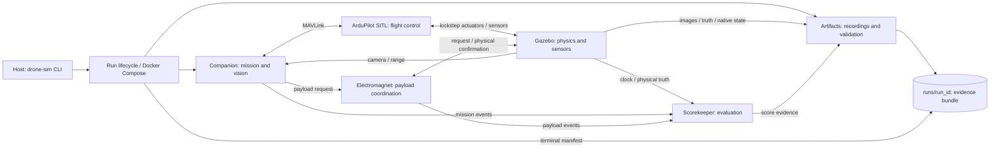

# Architecture and code map

[Start here](../README.md) · [Runbook](runbook.md) · [Current status](handoff.md)

## The system in one picture


```mermaid
flowchart LR
    CLI[Host: drone-sim CLI] --> LIFE[Run lifecycle / Docker Compose]
    LIFE --> M[Companion: mission and vision]
    LIFE --> REC[Artifacts: recordings and validation]
    M <-->|MAVLink| AP[ArduPilot SITL: flight control]
    AP <-->|lockstep actuators / sensors| GZ[Gazebo: physics and sensors]
    GZ -->|camera / range| M
    M -->|payload request| EM[Electromagnet: payload coordination]
    EM <-->|request / physical confirmation| GZ
    GZ -->|clock / physical truth| SC[Scorekeeper: evaluation]
    M -->|mission events| SC
    EM -->|payload events| SC
    GZ -->|images / truth / native state| REC
    SC -->|score evidence| REC
    REC --> B[(runs/run_id: evidence bundle)]
    LIFE -->|terminal manifest| B
```

This is a responsibility map, not an exhaustive ROS topic diagram. The physical
runtime uses seven services from [compose.yaml](../compose.yaml). `phase3` means
the real Gazebo/SITL stack here, including the mission and scorer; it does not
mean that flight control is still unimplemented. `phase2` uses synthetic peers
to exercise lifecycle and recording infrastructure.

## Follow one run

1. The host CLI resolves a template, assigns a run ID, records configuration and
   source provenance, and starts prebuilt images in an isolated Compose project.
2. Runtime processes establish actual endpoint readiness. Gazebo/SITL perform
   private warmup before the public simulation epoch is released. Public time
   starts at zero; warmup is not a payload mission phase.
3. The companion selects an existing mission or the configured operation runner.
   Camera/range data enters through the host adapter; vehicle commands go through
   MAVLink. Configured diagnostics do not invoke the bundled Comp2026 missions.
4. ArduPilot executes flight control; Gazebo determines movement and payload
   attachment. A mission command or an accepted service request is not proof of
   a physical pickup. Inspect payload height, attachment, release, and settlement.
5. The scorer reads events and physical states. Artifacts records evidence.
   Flight completion, score, and complete/valid artifacts are separate outcomes.
6. At finalization, publishers stop, recorders drain and close, and the host
   validates and commits `manifest.json`. Its terminal state is the run result.

Gazebo owns simulation time. Wall-clock deadlines detect infrastructure stalls;
they do not advance the mission. The public camera/state grid is 50 ms (20 Hz).
Slow rendering can make a short simulated mission take a long time in reality.

## Where to read or change code

Start with the module relevant to your task. Each guide links its executable
interfaces, implementation entry points, tests, and important constraints.

| Module guide | Owns |
| --- | --- |
| [Orchestration](../orchestration/README.md) | Host CLI, run lifecycle, readiness, finalization, terminal manifest |
| [Artifacts](../artifacts/README.md) | Video/bag recording, checksums, artifact validation |
| [Companion](../companion/README.md) | Mission selection, nested mission integration, sensors and MAVLink commands |
| [ArduPilot SITL](../ardupilot_sitl/README.md) | Flight-control process, transport, persistent parameter overlay |
| [Gazebo](../gazebo/README.md) | Physics, models, native/public time, camera/range and physical payload truth |
| [Electromagnet](../electromagnet/README.md) | Payload requests and physically confirmed events |
| [Scorekeeper](../scorekeeper/README.md) | Read-only competition evaluation and evidence-linked points |

## Shared communication guarantees

Configured missions validate their fixed sequence before opening live resources.
The plan is frozen under the run configuration checksum. Each operation waits
for observed success before the next starts; failure ends the sequence. Final
success requires landing and disarm. Any local LAND recovery remains separate
from mission success; scoring and artifact validity remain independent.

After passive readiness, matching RUNNING, and accepted public clock, the
companion publishes typed `MissionExecutionReadyStatus`. Gazebo selects this
release fact only for `mission: configured`. Operator waiting can then observe
advancing simulation without a fabricated GUIDED command. Other missions keep
their existing command-delivery gate. See the
[tool contract](../companion/README.md#configured-diagnostic-missions).

ROS messages/services define the wire format; the linked module guides identify
producers, consumers, and their endpoint QoS. Public physical positions use ENU.
Gazebo rebases native timestamps onto the public epoch; the first 20 Hz camera
sample is at 50 ms with frame ID zero. Do not substitute wall time for simulation
time or hide gaps by restamping queued samples. Run IDs isolate streams; invalid
ordering or missing required samples fail validation rather than proving success.
Reliable transport with bounded history is not a guarantee of lossless recording.

[`runtime_status.py`](../artifacts/src/artifacts/runtime_status.py) is the single
owner of typed runtime status schemas, canonical JSON conversion, registered
names, and write policy. [`RuntimeProtocol`](../artifacts/src/artifacts/runtime_protocol.py)
adapts that contract for container producers and consumers;
[`StatusStore`](../orchestration/src/orchestration/status_store.py) adapts it for
the host controller. Both use the strict, descriptor-relative persistence in
[`protocol_files.py`](../artifacts/src/artifacts/protocol_files.py).
Manifest producers and both readers accept only portable POSIX-relative paths,
as defined by [`is_manifest_relative_path`](../artifacts/src/artifacts/manifest.py)
and the [`manifest.json` schema](../artifacts/schemas/manifest.schema.json).

Readers request an exact registered status type. Subclasses and a same-named
unregistered class cannot select a schema. Runtime failures use first-wins
publication so concurrent producers preserve one valid initial cause; other
status files accept only byte-equivalent canonical retries. Path changes,
conflicting immutable values, and wrong file modes make writers fail closed, and
callers do not repair or reinterpret malformed facts. Cooperating helper callers
serialize through an advisory directory lock and publish durable atomic files.
This is not a security boundary against a hostile process with the same
filesystem permissions.

Typed `GazeboReadyStatus` always includes a real ArduPilot flight exchange. The
passive `phase3_foundation` world has no such exchange and the Gazebo runtime now
rejects it before server startup. Operators who still need that passive world
require a separate readiness-contract decision; endpoint presence is not valid
flight readiness evidence.

Comp2026 process readiness does not release the original mission worker. The
[runtime composition](../companion/src/drone_sim_companion/runtime_node.py)
must assign the initial GUIDED mode and complete the durable
[`MissionCommandDeliveredStatus`](../artifacts/src/artifacts/runtime_status.py)
write by the inclusive 50 ms public-time limit before the
[start gate](../companion/src/drone_sim_companion/comp2026_host.py) can release
that worker. The [companion lifecycle](../companion/src/drone_sim_companion/lifecycle.py)
owns the executable deadline and status write. A missed deadline, mode-setting
error, or status-write error fails the attempt and leaves the gate closed.

For payload precision landing, the camera boundary returns a marker vector and
its source timestamp atomically; a side-channel timestamp is not sufficient
freshness evidence. The hosted mission owns the fixed earth-frame target anchor,
measurement acceptance, LAND/GUIDED hold transitions, and one bounded return to
the search hover. ArduPilot owns stabilization and descent execution, but only
accepted observations reach its `LANDING_TARGET` input. No target messages are
sent during the GUIDED hold. Once LiDAR reports an AGL at or below the overlay's
`PLND_ALT_MIN`, the companion keeps LAND active and no longer requires marker
visibility; ArduPilot then owns the final descent and touchdown decision. The
parameter overlay remains the durable source of flight-controller settings, and
the companion reads those live settings before entering the first precision
LAND.

A payload request is intent, not physical success. Electromagnet waits for the
matching Gazebo confirmation; exact duplicate requests are idempotent and
conflicting reuse of an ID is rejected. A matching physical success is cached
before its at-most-once event-publication attempt, so a publisher exception makes
the first call ambiguous while exact retries replay success without republishing.
Recurring physical payload state, not a service response, establishes actual
attachment and lift.

Finalization is a file-backed handshake: a finalize request leads to publisher
quiescence, a runtime-frozen marker, closed artifacts and an artifacts-final
record, then the host's terminal manifest/commit marker. Read the
[orchestration](../orchestration/README.md) and [artifacts](../artifacts/README.md)
guides before changing this ordering. A landed vehicle is not a terminal run.

## Sources of truth

| Question | Inspect |
| --- | --- |
| What will the next default mission run? | [default-run.json](../config/default-run.json), then [config validation](../orchestration/src/orchestration/config.py) |
| Where are the course and targets? | [course.yaml](../config/course.yaml), [scenario.yaml](../config/scenario.yaml), and the selected Gazebo world/model resources |
| What flight parameters survive a new container? | [descent.parm](../ardupilot_sitl/params/descent.parm) and its load path in [SITL config](../ardupilot_sitl/src/drone_sim_ardupilot/config.py); rebuild the SITL image after changing them |
| What gets copied into the mission image? | [companion Dockerfile](../companion/Dockerfile) and the allowlist in [.dockerignore](../.dockerignore), not the entire nested repository |
| What are the wire schemas? | [ROS messages/services](../ros_ws/src/simulation_interfaces), with QoS at the actual publisher/subscriber and [recording overrides](../artifacts/recording-qos.yaml) |
| What counts for points? | [versioned rules](../scorekeeper/rules) and scorer implementation; never the mission's success print alone |
| Which code/images produced an old result? | That run's `configuration/run.json`, manifest source revisions/image digests, and logs; mutable local Docker tags and today's Git HEAD are not historical evidence |
| Which topics are actually in the bag? | `BASE_TOPICS`, `COMPETITION_TOPICS`, and `MOVING_PAD_TOPICS` in the [bag adapter](../artifacts/src/artifacts/_adapters/rosbag.py) |

The bag stores camera **metadata**, not raw image pixels. The MP4s are the image
recordings; a bag cannot recreate a lost recording. Private Gazebo topics also
are not automatically included in the public evidence bag.

Course YAML is not a dynamic world editor. Gazebo uses checked-in generated SDF
and assets, while mission/policy code reads configuration and validators enforce
fixed competition values. A geometry change must keep those representations
aligned; start at [prepare_competition_assets.py](../gazebo/scripts/prepare_competition_assets.py)
and [competition_config.py](../gazebo/src/drone_sim_gazebo/competition_config.py).

## Boundaries to preserve

- Mission intent belongs to the companion, flight execution to ArduPilot, and
  physical outcomes to Gazebo. Do not fix missed pickups by editing the scorer.
- Electromagnet coordinates payload actions through Gazebo's public interface;
  it does not directly edit the aircraft state.
- Scorekeeper is read-only. Payload IDs **2, 3, 4** mean the first, second, and
  third payloads respectively; marker 4 is not a fourth payload. The first
  payload starts attached in the competition model; the other two require pickup.
- Preserve run evidence. Do not rewrite a manifest or remove timestamp checks to
  turn a diagnostic failure into a passing run.
- A source edit is not an image update. Source provenance, image build identity,
  and runtime evidence must agree before claiming a verified result.

## Moving-pad landing

Design approved 2026-09-24; implementation under verification. This is the contract
for one regression mission: takeoff, transit, and camera-guided landing on a
platform moving straight at 0.5 m/s from public simulation time zero through
touchdown. The platform continues moving after disarm. ArUco 7 identifies the
landing target; this mission does not pick up or deliver a payload.

### Course and acquisition

The course has a 3 m square deck, 0.2 m above the floor, with
a centered 0.1 m marker. The vehicle starts at local ENU (0, 0); the pad starts
at (10, 0) and travels east. The vehicle takes off to 5 m above home and transits
to (35, 0), ahead of the pad. The pad reaches that waypoint at 50 simulated
seconds. The automatic example must arrive and settle by 45 seconds; a late
arrival fails this attempt rather than starting an unbounded pursuit.

The downward camera reuses competition geometry, with matching
[intrinsics](../companion/src/drone_sim_companion/moving_pad_camera_calibration.json)
and [mount metadata](../companion/src/drone_sim_companion/moving_pad_camera_mounting.json).
The configured host subscribes to images and range for precision-landing plans.
Unverified calibration or mounting prevents precision readiness.
Its 0.6-radian horizontal field of view at 640x480 covers approximately 3.1 by
2.3 m at 5 m above a level surface. The usable marker-detection region is smaller;
vehicle tilt, the camera offset, deck height, marker size, and frame age affect
acquisition. With the proposed deck and camera offset, coverage is about 2.9 by
2.2 m. Align the route with the image's long axis and hold yaw during acquisition.
The course creates an arrival window. Actual rendered images must establish
target lock; reaching a waypoint alone does not authorize descent.

Camera acquisition and detection run throughout takeoff, transit, and landing.
A bounded camera worker publishes the latest timestamped observation; image
processing cannot block the flight owner or accumulate stale frames. There is
one active flight operation. Watching the camera does not cancel or redirect
the waypoint operation in this first version.

At the approach waypoint, the vehicle holds while the pad enters view. The
precision-landing operation accepts only fresh observations of marker 7 and
must establish continuous usable observations for two simulated seconds before
requesting LAND. Accepted camera offsets can initialize ArduPilot's target
estimator during GUIDED without changing the waypoint command. Observations
older than 0.25 simulated seconds cannot authorize descent. Acquisition must
finish by public time 60 seconds; a missed pass or camera timeout fails the run.

### Landing and module boundaries

Keep explicit mode and arm calls, followed by takeoff, waypoint, and one new
precision-landing operation. The config remains a fixed sequence. The new
operation owns acquisition and tracking; ArduPilot owns flight stabilization
and descent. Pad pose, velocity, and contact truth are available to evaluation
and recording only. Autonomy uses camera, range, and vehicle telemetry.

Use a dedicated moving-target parameter profile, initially `PLND_OPTIONS=5`
and `PLND_EST_TYPE=1`, retaining the 0.5 m/s final descent setting. Bit 0 enables
moving-target support; bit 2 preserves final descent speed. The current raw
estimator supplies no target-velocity estimate. These are initial settings to
verify in simulation, not a validated tuning claim. See
[ArduPilot's landing documentation](https://ardupilot.org/copter/docs/precision-landing-and-loiter.html)
and the [pinned estimator implementation](https://github.com/ArduPilot/ardupilot/blob/1511f27194f1dcc3728270883047bdf022b3fd53/libraries/AC_PrecLand/AC_PrecLand.cpp#L415).

The moving operation must accept coherent target motion instead of applying
the existing fixed-anchor drift rejection. Continue feeding valid observations
near the deck. Above 0.75 m clearance, tracking loss lasting 0.5 simulated seconds
ends the landing attempt and requests GUIDED hold before bounded host recovery.
Below that height, permit
ArduPilot's final touchdown handoff after recent valid tracking; touchdown must
follow within three simulated seconds. Recovery cannot turn a failed attempt
into success. Existing stationary landing behavior and its profile stay intact.

Gazebo moves the pad collision surface and marker together with physical surface
velocity. Contact must carry the aircraft after landing. Publish pad pose/twist
and pad-specific contact evidence on the same 20 Hz public clock as vehicle
truth. The scorer checks touchdown on the deck, disarm, and two continuous
simulated seconds aboard the moving platform. Record touchdown offset and
relative velocity as diagnostics. Ground contact elsewhere is not a pass.

### Verification and scope

Focused checks cover concurrent transit/observation, stale or wrong marker
rejection, missed acquisition, and pad-relative touchdown evaluation. A rendered
camera check establishes marker detection at approach height. Then rebuild
matching images and run a stationary control followed by the 0.5 m/s mission.
Report physical outcome, evaluation, and artifact validity separately, with
onboard and observer recordings. No current recording verifies this proposal.

Implementation affects companion vision/operations, Gazebo world/motion and
truth, the SITL profile, configuration, and scoring/recording. Update their
guides and the runbook with executable entry points when those exist. Turns,
search sweeps, replanning the intercept during transit, payload handling, and
agent transport are deferred. This design is separate from the core-runner PR.

### Moving-pad landing implementation plan

> For implementation: use `superpowers:executing-plans` for inline execution,
> or `superpowers:subagent-driven-development` if requested. Follow the project
> preference for focused checks and no unsolicited review cycles.

**Goal:** produce an accepted, recorded moving-platform landing with continuous
camera observation during transit.

**Architecture:** retain fixed-sequence execution and one flight owner. Gazebo
drives a physical deck and publishes evaluation truth; the companion feeds
camera observations to ArduPilot. Extend the existing scoring and artifact
paths with one explicit scenario, without a general scenario framework.

**Tech stack:** existing Python 3.12, ROS 2 Jazzy, Gazebo Sim 8/C++17, OpenCV,
and the pinned ArduPilot build. **Spec:** the preceding
[moving-pad design](#moving-pad-landing).

#### Global constraints and verification focus

The approved geometry, deadlines, freshness limits, and ownership above apply
to every task. Work in `design/moving-pad-landing`; preserve the core-runner PR,
the imported Comp2026 source, existing profiles, and all run evidence. No new
host dependencies, firmware version, CI service, or general mission language.
Keep the implementation plan here during execution, then replace it with the
implemented contract; Git retains the completed plan.

The five required checks are physical carriage, acquisition without blocking
transit, stale/lost target behavior, truthful pad-relative scoring, and a fresh
recorded run. These belong to tasks 1 through 5 respectively. Test failures
must be diagnosed rather than accommodated by loosening acceptance.

#### Task 1: Physical deck and camera scene

**Create:** `gazebo/plugin/MovingPadController.cc`,
`gazebo/plugin/test/MovingPadControllerIntegrationTest.cc`, models under
`gazebo/resources/models/moving_pad/` and `iris_moving_pad/`, worlds
`gazebo/resources/worlds/moving_pad_landing.sdf` and `moving_pad_stationary.sdf`,
and `gazebo/tests/test_moving_pad_resources.py`.
**Modify:** `gazebo/plugin/CMakeLists.txt`, `gazebo/Dockerfile`,
`gazebo/src/drone_sim_gazebo/worlds/api.py`, and `gazebo/README.md`.
**Interface:** the model plugin reads `joint_name`, `motion_start_sim_time_s`,
and `velocity_mps`; native deck odometry and contact sensors feed task 2 on
`/gazebo/private/moving_pad/odometry` and `/gazebo/private/moving_pad/contact`.
The stationary world is a verification fixture, sharing both models; its deck
starts at the approach point with velocity zero. The operator-facing mission
uses the moving world.

- [ ] Add a real-server CTest, following the existing detachable-joint test,
  with a shortened warmup, a deck, and a passive rider. Initially it must fail
  because the controller is absent. Check no warmup movement, 0.5 m/s after
  release, approximately 1 m displacement over two public seconds, and rider
  support/carriage. Also run the same fixture at zero speed.
- [ ] Implement a dynamic deck on a world-fixed prismatic joint along +X. In
  `Configure`, resolve `Model(entity).JointByName(ecm, joint_name)` and reject
  a missing joint. In `PreUpdate`, skip paused updates and apply:

  ```cpp
  const double native_s =
      std::chrono::duration<double>(info.simTime).count();
  gz::sim::Joint(joint_entity).SetVelocity(
      ecm, {native_s >= motion_start_sim_time_s ? velocity_mps : 0.0});
  ```

  Use [Joint::SetVelocity](https://gazebosim.org/api/sim/8/classgz_1_1sim_1_1Joint.html)
  without a competing force controller. Do not reset poses or attach the drone
  artificially. A contact test establishes friction and scoped collision names.
- [ ] Add the camera/range elements from the existing competition sensor model
  to the derived Iris model, without payload hardware. Generate marker 7 with
  the existing ArUco dictionary. Place the observer to cover the entire route;
  keep both recordings 640x480/20 Hz. Use the fixed 90-second native warmup.
- [ ] Build the Gazebo image and run the new named CTest through the existing
  Docker build, then run `uv run --locked pytest gazebo/tests/test_moving_pad_resources.py -q`.
  Expected: real contact/carriage and model/resource checks pass. Stop here if
  the deck cannot carry the rider; do not substitute visual movement.
- [ ] Update the Gazebo guide with the scene/controller contract and commit
  only task files: `git commit -m "Add physical moving-pad scene"`.

#### Task 2: Pad truth and scenario selection

**Create:** `ros_ws/src/simulation_interfaces/msg/LandingPadState.msg`,
`gazebo/config/bridge-moving-pad.yaml`, and
`gazebo/src/drone_sim_gazebo/ros_adapter/landing_pad.py`.
**Modify:** the interface CMake list; Gazebo `ros_adapter/{topics,node,aggregation}.py`
and `runtime/{entrypoint,children,runtime_node}.py`, plus `server/process.py`;
orchestration `config.py` and its tests; template
and resolved JSON schemas; affected Gazebo/orchestration guides.
**Interface:** `/simulation/landing_pad_state` uses this new message; it is
recorded/scored only. The public camera and `/competition/range/downward` retain
their existing types. Both verification worlds select `scenario: moving_pad_v1`.

```text
string run_id
builtin_interfaces/Time sim_timestamp
uint32 marker_id
geometry_msgs/Pose pose
geometry_msgs/Twist twist
bool vehicle_in_contact
```

- [ ] Add failing adapter tests for warmup exclusion, matching 20 Hz timestamps,
  and deck/leg contact identity. Feed a deck-floor or vehicle-floor contact and
  require `vehicle_in_contact == false`; an Iris-leg/deck pair must be true.
- [ ] Translate native deck odometry and contacts through the existing epoch
  and bounded aggregation path. Publish false contact samples while airborne;
  absent data is not false contact. Reject missing/regressing same-run evidence
  through the existing adapter fault path. Record actual deck pose and velocity,
  not values calculated from the nominal route.
- [ ] Register both worlds and their bridge/topic inventories, including recorder
  discovery. Add an opt-in valid tuple: configured mission, moving-pad world,
  Iris moving-pad vehicle, moving-pad rules, 640x480, and 90-second warmup.
  Reject other combinations before launch. Existing selector behavior stays
  unchanged; no new arbitrary world or parameter override field is needed.
- [ ] Run `uv run --locked pytest gazebo/tests/test_adapter_node.py gazebo/tests/test_private_aggregation.py gazebo/tests/test_world_resources.py orchestration/tests/test_config.py tests/contracts -q`.
  Expected: new truth/selection cases and existing contracts pass. Add message
  field assertions to `tests/contracts/test_moving_pad_interfaces.py`.
- [ ] Document the truth producer/consumers and commit task files with
  `git commit -m "Publish moving-pad truth on the public simulation clock"`.

#### Task 3: Observe during transit and precision-land

**Create:** `companion/src/drone_sim_companion/moving_precision.py`,
`moving_vision.py`, verified `moving_pad_camera_{calibration,mounting}.json`,
`companion/tests/test_moving_precision.py`, and `test_moving_vision.py`.
**Modify:** companion `operations.py`, `mission_plan.py`, `mission.py`,
`mavlink_adapter.py`, `configured_runtime.py`, their focused tests, and packaging
allowlist only if the camera import closure requires it. Add
`ardupilot_sitl/params/moving-pad.parm`, update SITL `config.py`/`runtime_node.py`
and their tests, and update both module guides.

**Interfaces:** `MovingVision.start()`, `latest()`, and `close(timeout_s)` wrap
the existing camera/frame worker. `latest()` returns an immutable observation
or `None`, carrying source timestamp/sequence, marker ID, body-FRD vector, and
coherent range/attitude evidence. The worker never sends vehicle commands.
`MovingPrecisionLanding.start(marker_id, settle_by_ns, acquire_by_ns)`,
`observe(observation)`, `tick(timestamp_ns, vehicle_state)`, and `abort(reason)`
run only on the flight-owner thread. `tick` returns state/error plus optional
target measurement and requested mode; the owner applies those effects once.
Inject it into `DroneOperations`; existing `OperationStatus` remains the result.
Use an immutable `PrecisionStatus` with `state`, `error`, `target_body_frd`, and
`requested_mode` fields. States are `running`, `succeeded`, or `failed`; optional
effects are `None` when absent. An observation carries separate source times
for camera, range, and attitude so stale inputs remain detectable.

- [ ] Add failing fake-vehicle/clock tests: moving observations accepted during
  waypoint transit without another flight action; stale/wrong-marker data cannot
  authorize LAND; valid observations spanning two seconds request LAND once;
  late settlement/acquisition fails; tracking-loss and final-touchdown deadlines
  match the approved spec. Update `test_configured_live_loop.py` to prove image
  acquisition starts before flight and stops during teardown without hanging.
- [ ] Implement the policy without importing the stationary fixed-anchor code.
  Forward only new, valid target measurements. At the waypoint, require fresh
  horizontal speed <=0.2 m/s for 0.5 simulated seconds before the settlement
  deadline. A duplicate image cannot extend target health or the acquisition
  interval. Keep near-deck observation active and preserve failure through
  existing bounded recovery. The tool arguments are:

  ```json
  {"tool":"precision_land","args":{"marker_id":7,"settle_by_sim_s":45,"acquire_by_sim_s":60},"timeout_sim_s":45}
  ```

  Validate integer marker ID, finite positive deadlines, and settlement before
  acquisition. One precision operation owns all acquisition/landing phases.
- [ ] Wire image/range subscriptions only for plans containing this tool;
  reuse the existing frame source and detection thread. Add ATTITUDE and
  PARAM_VALUE observations to the MAVLink adapter, with
  `request_parameters(names)` and `send_landing_target(forward_m,right_m,down_m)`.
  Test BODY_FRD encoding and exposure timestamps. Complete verified camera
  metadata by checking the actual SDF transform and a rendered marker pose.
- [ ] Load the ordinary SITL defaults followed by the two-line moving override
  below, selected only by the frozen moving-pad scenario. Extend `RuntimeConfig`
  with an optional overlay path and build ArduPilot's comma-separated `--defaults`
  argument. Request/validate the full effective precision profile before flight
  commands, preserving passive execution readiness without waiting for a marker
  while physics is paused.

  ```text
  PLND_OPTIONS 5
  PLND_EST_TYPE 1
  ```

  Run `uv run --locked pytest companion/tests/test_moving_precision.py companion/tests/test_moving_vision.py companion/tests/test_configured_host.py companion/tests/test_configured_live_loop.py companion/tests/test_configured_mission.py companion/tests/test_mavlink_adapter.py ardupilot_sitl/tests/test_config.py ardupilot_sitl/tests/test_runtime_node.py -q`.
  Expected: a profile mismatch emits zero flight commands; ordinary missions
  still use their original profile and behavior. Pin the companion's expected
  effective values against the base and override parameter files in that test.
- [ ] Update companion/SITL guides and commit task files with
  `git commit -m "Add observed moving-target precision landing"`.

#### Task 4: Score and preserve physical evidence

**Create:** `scorekeeper/rules/moving_pad_v1.json`, scorekeeper
`moving_pad.py`/`moving_pad_runtime.py`, and artifacts
`moving_pad_score_validation.py`, each with focused tests.
**Modify:** scorekeeper `runtime_node.py`; artifacts `runtime_configuration.py`,
`_adapters/rosbag.py`, `score_validation.py`, `acceptance.py`, and recording QoS;
orchestration `controller.py`; companion `configured_runtime.py`; affected guides.
**Interfaces:** `MovingPadScorer(run_id,rules,expected_frames)` accepts joined
vehicle/pad samples via `accept_frame(vehicle,pad)` and fresh disarm evidence
via `accept_disarmed(timestamp_ns)`. Expose `fail`, `finalize`, and the existing
`ScoreResult` contract to `_ScoreFinalizer`. Companion emits ordered
`MissionEvent` phase `MOVING_PAD`, states `ARMED`/`DISARMED`, from observed
transitions. Mission success text is not evidence of deck contact.
Use existing `GroundTruthSample` for the vehicle. Define `LandingPadSample` in
`moving_pad.py` with the matching run/time, marker ID, position/orientation,
linear/angular velocity, and `vehicle_in_contact` fields from LandingPadState.
The runtime joins samples by exact timestamp before calling `accept_frame`.

- [ ] Add failing scorer cases: true deck landing, floor landing near the marker,
  marker passing underneath an airborne vehicle, sliding off before two seconds,
  and missing/misaligned pad truth. A two-second interval requires endpoint
  timestamps two seconds apart, not merely 40 samples at 20 Hz.
- [ ] Implement a single 100-point physical-pass rule. After observed disarm,
  require continuous pad contact, vehicle position above/within the deck, and
  two seconds aboard. Missing evidence makes the result incomplete; a complete
  failed landing scores zero. Preserve touchdown offset and relative velocity
  diagnostics. The stationary fixture uses identical rules and measured pose.
- [ ] Add the pad state, mission transitions, and range to one explicit moving-pad
  rosbag inventory. Extend bag inspection with exact sample/run/clock checks.
  Wire `moving_pad_v1` explicitly through recorders, scenario runtime, score
  validation, host finalization, and acceptance; it must never fall through to
  the stationary descent rules. Recompute physical acceptance from recorded
  truth and compare it with persisted scores and manifest provenance.
- [ ] Run `uv run --locked pytest scorekeeper/tests/test_moving_pad.py scorekeeper/tests/test_moving_pad_runtime.py artifacts/tests/test_moving_pad_score_validation.py artifacts/tests/test_runtime_configuration.py artifacts/tests/test_rosbag_adapter.py artifacts/tests/test_acceptance.py orchestration/tests/test_controller.py -q`.
  Expected: positive fixture passes, negative physical cases cannot pass, and
  missing evidence cannot produce a completed valid bundle.
- [ ] Update evidence/scoring guides and commit task files with
  `git commit -m "Validate moving-pad landing from recorded physical evidence"`.

#### Task 5: Run the stationary control, then moving mission

**Create:** `config/configured-moving-pad-run.json` and the stationary control
fixture `tests/fixtures/configured-stationary-pad-run.json` with root-relative
launch instructions. **Modify:** `README.md`, `docs/runbook.md`, and
`docs/handoff.md` after verification. Extend existing packaging/resource tests
for the new models, profile, plugin, and message; do not add a deployment system.
**Interface:** existing `drone-sim start --config` and `artifacts.acceptance`.

- [ ] Resolve the two templates before launch. Both use the approved fixed
  sequence, calibrated camera, 90-second native warmup, 90-second public window,
  and target real-time factor 0.1. Compute the WGS84 waypoint for local ENU
  (35,0) from the existing SITL home using the established coordinate mapping;
  check the conversion. The control world keeps its deck at this waypoint.
- [ ] Run the focused suites from tasks 1-4 once on the assembled tree, check
  Compose and image import/resource contracts, then commit the runnable config.
  Record clean source HEAD, effective parameters, and seven image digests before
  launching. Build from this worktree, with no concurrent run using mutable tags:

  ```bash
  uv sync --locked
  SIM_COMP2026_REVISION=$(git rev-parse HEAD) docker compose --profile phase3 build
  uv run --locked drone-sim start --config tests/fixtures/configured-stationary-pad-run.json
  ```

- [ ] Independently accept the stationary bundle using the existing runbook
  procedure and the moving-pad rules, requiring maximum score and matching
  build provenance. Then run:

  ```bash
  uv run --locked drone-sim start --config config/configured-moving-pad-run.json
  ```

  Each run targets 30 wall minutes of simulation plus startup/finalization at
  the configured real-time factor. These are estimates, not deadlines or proof.
- [ ] Inspect camera acquisition before LAND, pad velocity through touchdown,
  fresh disarm, and two seconds of carriage in recorded truth and videos.
  Independently accept the moving bundle. Report physical outcome, score, and
  artifact validity separately. Preserve failed attempts; do not change motion
  or evidence to manufacture a pass. After three failed fixes, stop and name
  the doubtful assumption, following the project rule.
- [ ] Replace this execution checklist with the implemented contract. Update
  the README/runbook commands, affected module guides, and dated handoff with
  run IDs, provenance, acceptance results, video paths, and remaining limits.
  Commit documentation separately from the runtime commit used by the recordings.
