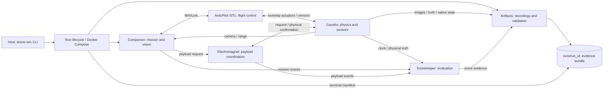
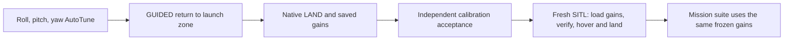

# Architecture and code map

[Start here](../README.md) · [Runbook](runbook.md) · [Current status](handoff.md)

## The system in one picture

```mermaid
flowchart LR
    CLI[Host: drone-sim CLI] --> LIFE[Run lifecycle / Docker Compose]
    LIFE --> M[Companion: mission and vision]
    LIFE --> REC[Artifacts: recordings and validation]
    M <-->|MAVLink| AP[ArduPilot SITL: flight control]
    AP <-->|lockstep actuators / sensors| GZ[Gazebo: physics and sensors]
    GZ -->|camera / range| M
    M -->|payload request| EM[Electromagnet: payload coordination]
    EM <-->|request / physical confirmation| GZ
    GZ -->|clock / physical truth| SC[Scorekeeper: evaluation]
    M -->|mission events| SC
    EM -->|payload events| SC
    GZ -->|images / truth / native state| REC
    SC -->|score evidence| REC
    REC --> B[(runs/run_id: evidence bundle)]
    LIFE -->|terminal manifest| B
```

This is a responsibility map, not an exhaustive ROS topic diagram. The physical
runtime uses seven services from [compose.yaml](../compose.yaml). `phase3` means
the real Gazebo/SITL stack here, including the mission and scorer; it does not
mean that flight control is still unimplemented. `phase2` uses synthetic peers
to exercise lifecycle and recording infrastructure.

## Follow one run

1. The host CLI resolves a template, assigns a run ID, records configuration and
   source provenance, and starts prebuilt images in an isolated Compose project.
2. Runtime processes establish actual endpoint readiness. Gazebo/SITL perform
   private warmup before the public simulation epoch is released. Public time
   starts at zero; warmup is not a payload mission phase.
3. The companion selects an existing mission or the configured operation runner.
   Camera/range data enters through the host adapter; vehicle commands go through
   MAVLink. Configured diagnostics do not invoke the bundled Comp2026 missions.
4. ArduPilot executes flight control; Gazebo determines movement and payload
   attachment. A mission command or an accepted service request is not proof of
   a physical pickup. Inspect payload height, attachment, release, and settlement.
5. The scorer reads events and physical states. Artifacts records evidence.
   Flight completion, score, and complete/valid artifacts are separate outcomes.
6. At finalization, publishers stop, recorders drain and close, and the host
   validates and commits `manifest.json`. Its terminal state is the run result.

Gazebo owns simulation time. Wall-clock deadlines detect infrastructure stalls;
they do not advance the mission. The public camera/state grid is 50 ms (20 Hz).
Slow rendering can make a short simulated mission take a long time in reality.
Host orchestration owns polling of durable statuses and Compose child health;
the [orchestration guide](../orchestration/README.md) defines its cadence and
deadline behavior. Host polling changes do not alter simulation, flight,
scoring, or lifecycle deadlines.
Flight physics and raw IMU publication share a 1 ms native grid. Except for the
single paused `0.000001`-second peer bootstrap, Gazebo's ArduPilot JSON producer
must use the IMU sample whose integer timestamp equals the current physics step.
It may wait up to one wall second for the parallel sensor worker. Missing,
future, or regressing samples stop the native server and fail the runtime; they
must not be replaced by the latest cached sample.

For `competition_v1`, Gazebo's private JSON exchange also carries seven native
RC PWM inputs. ArduPilot owns their receiver health and mode-switch effect: RC7
at 1500 selects GUIDED, while 1000 and 2000 select STABILIZE and LOITER takeover
slots. This input is scoped to the competition vehicle and is distinct from
MAVLink RC override or fabricated telemetry. Other scenarios do not receive RC
fields through the JSON bridge.

The shared downward ray also enters the ArduPilot plugin in every generated
vehicle variant and is serialized as JSON `rng_1`. The competition parameter
overlay alone enables SITL rangefinder instance 1, with the same 0.05–40 m
limits as the Gazebo sensor. ArduPilot then publishes flight-controller
`DISTANCE_SENSOR` for the original mission's source-filtered startup telemetry
proof. The companion's operational clearance path remains the public ROS LiDAR
sample with its own timestamp and freshness checks. This common plugin wiring
is part of the calibration airframe fingerprint; the scenario-only ArduPilot
backend settings are part of the imported effective baseline and live readback.
The pinned upstream JSON backend mapped these range keys with the wrong bit
positions. The ArduPilot image applies upstream fix `8fa852b` as an audited
downstream patch while retaining source and firmware revision `1511f271`; its
build executes the extracted production update block against all six keys
before compiling Copter.

## Where to read or change code

Start with the module relevant to your task. Each guide links its executable
interfaces, implementation entry points, tests, and important constraints.

| Module guide | Owns |
| --- | --- |
| [Orchestration](../orchestration/README.md) | Host CLI, run lifecycle, readiness, finalization, terminal manifest |
| [Artifacts](../artifacts/README.md) | Video/bag recording, checksums, artifact validation |
| [Companion](../companion/README.md) | Mission selection, nested mission integration, sensors and MAVLink commands |
| [ArduPilot SITL](../ardupilot_sitl/README.md) | Flight-control process, transport, persistent parameter overlay |
| [Gazebo](../gazebo/README.md) | Physics, models, native/public time, camera/range and physical payload truth |
| [Electromagnet](../electromagnet/README.md) | Payload requests and physically confirmed events |
| [Scorekeeper](../scorekeeper/README.md) | Read-only competition evaluation and evidence-linked points |

## Shared communication guarantees

Configured missions validate their fixed sequence before opening live resources.
The plan is frozen under the run configuration checksum. Each operation waits
for observed success before the next starts; failure ends the sequence. Final
success requires landing and disarm. Any local LAND recovery remains separate
from mission success; scoring and artifact validity remain independent.

After passive readiness, matching RUNNING, and accepted public clock, the
companion publishes typed `MissionExecutionReadyStatus`. Gazebo selects this
release fact only for `mission: configured`. Operator waiting can then observe
advancing simulation without a fabricated GUIDED command. The first running wait
also publishes typed `OperatorWaitStartedStatus` through the companion's
production writer. The separate operator consumes this fact before its commands.
Other missions keep their existing command-delivery gate. See the
[tool contract](../companion/README.md#configured-diagnostic-missions).

The Comp2026 companion publishes `MissionReadyStatus` only after its real
MAVLink callbacks provide every fresh safe-ground observation and its full
calibration cache matches, while DroneKit reports a live heartbeat and healthy
prearm checks. Missing or stale observations keep the public epoch and mission
admission closed until the companion startup deadline; positively unsafe
observations fail admission. Orchestration may publish RUNNING only after this
durable status. The companion then waits for an accepted public clock before
releasing the worker, and FM1 admission repeats the full ground check before the
first guarded GUIDED command.

ROS messages/services define the wire format; the linked module guides identify
producers, consumers, and their endpoint QoS. Public physical positions use ENU.
Gazebo rebases native timestamps onto the public epoch; the first 20 Hz camera
sample is at 50 ms with frame ID zero. Do not substitute wall time for simulation
time or hide gaps by restamping queued samples. Run IDs isolate streams; invalid
ordering or missing required samples fail validation rather than proving success.
Reliable transport with bounded history is not a guarantee of lossless recording.

[`runtime_status.py`](../artifacts/src/artifacts/runtime_status.py) is the single
owner of typed runtime status schemas, canonical JSON conversion, registered
names, and write policy. [`RuntimeProtocol`](../artifacts/src/artifacts/runtime_protocol.py)
adapts that contract for container producers and consumers;
[`StatusStore`](../orchestration/src/orchestration/status_store.py) adapts it for
the host controller. Both use the strict, descriptor-relative persistence in
[`protocol_files.py`](../artifacts/src/artifacts/protocol_files.py).
Manifest producers and both readers accept only portable POSIX-relative paths,
as defined by [`is_manifest_relative_path`](../artifacts/src/artifacts/manifest.py)
and the [`manifest.json` schema](../artifacts/schemas/manifest.schema.json).

Readers request an exact registered status type. Subclasses and a same-named
unregistered class cannot select a schema. Runtime failures use first-wins
publication so concurrent producers preserve one valid initial cause; other
status files accept only byte-equivalent canonical retries. Path changes,
conflicting immutable values, and wrong file modes make writers fail closed, and
callers do not repair or reinterpret malformed facts. Cooperating helper callers
serialize through an advisory directory lock and publish durable atomic files.
This is not a security boundary against a hostile process with the same
filesystem permissions.

Typed `GazeboReadyStatus` always includes a real ArduPilot flight exchange. The
passive `phase3_foundation` world has no such exchange and the Gazebo runtime now
rejects it before server startup. Operators who still need that passive world
require a separate readiness-contract decision; endpoint presence is not valid
flight readiness evidence.

Comp2026 process readiness does not release the original mission worker. The
[runtime composition](../companion/src/drone_sim_companion/runtime_node.py)
must enqueue the initial GUIDED command through the imported output guards and complete the durable
[`MissionCommandDeliveredStatus`](../artifacts/src/artifacts/runtime_status.py)
write by the inclusive 50 ms public-time limit before the
[start gate](../companion/src/drone_sim_companion/comp2026_host.py) can release
that worker. The [companion lifecycle](../companion/src/drone_sim_companion/lifecycle.py)
owns the executable deadline and status write. A missed deadline, mode-setting
error, or status-write error fails the attempt and leaves the gate closed.
The worker then requires the native acknowledgement and observed GUIDED state
before entering the original sequencer. Its
[simulation control composition](../companion/src/drone_sim_companion/comp2026_control.py)
uses real source-filtered telemetry, RC authority, a consumed run-scoped attempt,
and the observed launch position including AMSL home altitude. Telemetry request
and firmware checks run before public release; cadence is checked on advancing
public simulation time after GUIDED. Clock freshness, mission phases and output
transactions retain the imported controller's guards. The simulation policy
binds the pinned firmware, course, scenario, model and parameter inputs and does
not approve physical-aircraft deployment.

For payload precision landing, the camera boundary returns a marker vector and
its source timestamp atomically; a side-channel timestamp is not sufficient
freshness evidence. The hosted mission owns the fixed earth-frame target anchor,
measurement acceptance, LAND/GUIDED hold transitions, and one bounded return to
the search hover. ArduPilot owns stabilization and descent execution, but only
accepted observations reach its `LANDING_TARGET` input. No target messages are
sent during the GUIDED hold. Once LiDAR reports an AGL at or below the overlay's
`PLND_ALT_MIN`, the companion keeps LAND active and no longer requires marker
visibility; ArduPilot then owns the final descent and touchdown decision. The
parameter overlay remains the durable source of flight-controller settings, and
the companion reads those live settings before entering the first precision
LAND.

A payload request is intent, not physical success. Electromagnet waits for the
matching Gazebo confirmation; exact duplicate requests are idempotent and
conflicting reuse of an ID is rejected. A matching physical success is cached
before its at-most-once event-publication attempt, so a publisher exception makes
the first call ambiguous while exact retries replay success without republishing.
Recurring physical payload state, not a service response, establishes actual
attachment and lift.

Finalization is a file-backed handshake: a finalize request leads to publisher
quiescence, a runtime-frozen marker, closed artifacts and an artifacts-final
record, then the host's terminal manifest/commit marker. Read the
[orchestration](../orchestration/README.md) and [artifacts](../artifacts/README.md)
guides before changing this ordering. A landed vehicle is not a terminal run.

## Sources of truth

| Question | Inspect |
| --- | --- |
| What will the next default mission run? | [default-run.json](../config/default-run.json), then [config validation](../orchestration/src/orchestration/config.py) |
| Where are the course and targets? | [course.yaml](../config/course.yaml), [scenario.yaml](../config/scenario.yaml), and the selected Gazebo world/model resources |
| What flight parameters survive a new container? | [descent.parm](../ardupilot_sitl/params/descent.parm) and its load path in [SITL config](../ardupilot_sitl/src/drone_sim_ardupilot/config.py); rebuild the SITL image after changing them |
| What gets copied into the mission image? | [companion Dockerfile](../companion/Dockerfile) and the allowlist in [.dockerignore](../.dockerignore), not the entire nested repository |
| What are the wire schemas? | [ROS messages/services](../ros_ws/src/simulation_interfaces), with QoS at the actual publisher/subscriber and [recording overrides](../artifacts/recording-qos.yaml) |
| What counts for points? | [versioned rules](../scorekeeper/rules) and scorer implementation; never the mission's success print alone |
| Which code/images produced an old result? | That run's `configuration/run.json`, manifest source revisions/image digests, and logs; mutable local Docker tags and today's Git HEAD are not historical evidence |
| Which topics are actually in the bag? | `BASE_TOPICS`, `COMPETITION_TOPICS`, and `MOVING_PAD_TOPICS` in the [bag adapter](../artifacts/src/artifacts/_adapters/rosbag.py) |

The bag stores camera **metadata**, not raw image pixels. The MP4s are the image
recordings; a bag cannot recreate a lost recording. Private Gazebo topics also
are not automatically included in the public evidence bag.

Course YAML is not a dynamic world editor. Gazebo uses checked-in generated SDF
and assets, while mission/policy code reads configuration and validators enforce
fixed competition values. A geometry change must keep those representations
aligned; start at [prepare_competition_assets.py](../gazebo/scripts/prepare_competition_assets.py)
and [competition_config.py](../gazebo/src/drone_sim_gazebo/competition_config.py).

## Boundaries to preserve

- Mission intent belongs to the companion, flight execution to ArduPilot, and
  physical outcomes to Gazebo. Do not fix missed pickups by editing the scorer.
- Electromagnet coordinates payload actions through Gazebo's public interface;
  it does not directly edit the aircraft state.
- Scorekeeper is read-only. Payload IDs **2, 3, 4** mean the first, second, and
  third payloads respectively; marker 4 is not a fourth payload. The first
  payload starts attached in the competition model; the other two require pickup.
- Preserve run evidence. Do not rewrite a manifest or remove timestamp checks to
  turn a diagnostic failure into a passing run.
- A source edit is not an image update. Source provenance, image build identity,
  and runtime evidence must agree before claiming a verified result.

## CI calibration design

Implemented 2026-09-29; calibration and fresh-process validation both passed
independent acceptance at 100/100 by 2026-10-02. The first deliverable is a reusable
calibration stage and a fresh-process validation flight; see
[current verification](handoff.md). The eventual CI runner invokes this stage
before the mission suite.
The local `suite` command implements this dependency using the
[executable catalog](../config/ci-suite.json). It builds once from clean committed
source, freezes all source/image identities and runs cases sequentially with
fresh SITL storage and Compose projects. Its account-wide workstation lock spans
checkouts/output roots. Failed calibration/reload gates block dependents; other
case failures continue unless provenance or teardown becomes uncertain. Reports
retain lifecycle, physical outcome, raw score, artifact acceptance and teardown
separately. Actual flight/provider verification remains in [handoff](handoff.md).

```mermaid
flowchart LR
    T[Roll, pitch, yaw AutoTune] --> R[GUIDED return to launch zone]
    R --> L[Native LAND and saved gains]
    L --> A[Independent calibration acceptance]
    A --> H[Fresh SITL: load gains, verify, hover and land]
    H --> M[Mission suite uses the same frozen gains]
```

### Aircraft and calibration flight

All suite scenarios use one competition airframe definition, including its
inertia, motor limits, sensor hardware, and payload mount. Payload attachment and
course geometry remain mission-specific. Calibration starts without a payload;
the competition flights exercise the same gains with their specified loads.
The [shared generator](../gazebo/scripts/prepare_competition_assets.py) produces
the diagnostic, moving-pad and competition variants from the same physical body.
The version-2 importer binds all three stock variants to one canonical physical
fingerprint and records their exact model digests. Only declared pose/payload
coordination plugins are excluded; unknown plugins and all dynamics remain
bound. Imported profiles freeze the consumer model and ordered parameter
overlays, with gains loaded last. Legacy version-1 imports remain unloaded-only.
The explicit `calibration_validation` flag distinguishes the reload hover from
ordinary calibrated missions.

After a healthy heartbeat, the companion writes the run-local seeds
`ATC_RAT_RLL_P=0.0675`, `ATC_RAT_RLL_I=0.0675`, and `AUTOTUNE_AXES=7` before
selecting GUIDED and requesting the complete parameter list. The global base
gains remain unchanged. Before arming, the companion requires a fresh, complete
readback of all 15 gain inputs and preserved base parameters. Roll seeds must
match within float32 tolerance and `AUTOTUNE_AXES` must equal 7. Missing values
or rejected seed writes fail within the existing 10-second entry phase.
Body-rate feedforward must already be enabled so calibration does
not silently change an unexported base setting.

The companion takes off in GUIDED, settles in LOITER for two seconds, then
commands and observes ALT_HOLD before entering AUTOTUNE. Starting native tuning
from ALT_HOLD disables its weak position hold and position-dependent heading
updates, which can otherwise breach the pitch settling guard. `AUTOTUNE_AXES=7`
requests roll, pitch, and the pinned implementation's standard yaw error-filter tuning.
Completion requires all three axes. A completed subset cannot release parameters
to the suite.

After tuning succeeds, the companion observes LOITER, invokes
`MAV_CMD_DO_AUX_FUNCTION` with function 180 and position 2 to activate tuned
gains, and waits for the matching testing status and live parameter readback.
It then settles, clears pilot overrides, and switches to GUIDED. A global-relative
waypoint returns to the fresh ground position captured before arming, at 5 m.
The return must finish within 60 simulated seconds and before the landing reserve.
Two continuous seconds within 0.5 m horizontally and vertically, with speed at
most 0.2 m/s and roll/pitch within 5 degrees, qualify native LAND. Stale or invalid
position never qualifies arrival. An ACK alone does not prove that
AutoTune accepted the gain-selection command. Unexpected mode changes, failed
tuning, stale telemetry, or expired simulation deadlines fail calibration.
Recovery landing never converts failure into success.
Neutral RC overrides must be refreshed throughout LOITER, ALT_HOLD entry, and
tuning: the pinned ArduPilot default expires them after three simulated seconds.
An unexpected mode, disarm before native landing, or expired phase deadline
fails immediately. Overrides remain cleared during the GUIDED return and native
LAND. Tuning may drift far from launch, so the bounded GPS waypoint return remains
mandatory. See [the measured drift and return](handoff.md) for diagnostic evidence.
Native LAND, disarm, and gain saving still follow the stable-arrival guards.
The 15-gain artifact, native gain guards, D and aggression settings, deadlines,
900-second recording window, and calibration scoring remain unchanged.

This order matters in the
[pinned AutoTune implementation](https://github.com/ArduPilot/ardupilot/blob/1511f27194f1dcc3728270883047bdf022b3fd53/libraries/AC_AutoTune/AC_AutoTune.cpp):
leaving AUTOTUNE restores original gains; activating tuned gains after that exit
allows native LAND followed by gain saving at disarm. This sequence has source
evidence and an independently accepted calibration flight; see
[current verification](handoff.md). The
[roll mission](../companion/src/drone_sim_companion/autotune.py) now applies the
same ordering to its five roll gains. It requires the roll-specific testing and
saved statuses, returns to the captured launch point, uses native LAND, and
checks that its coherent DataFlash save epoch matches the activated values. Its
original 120-second public deadline remains the outer bound; it does not inherit
the all-axis mission's 60-second landing reserve.

### Acceptance and parameter artifact

Calibration gets its own acceptance contract. It requires completed tuning for
all requested axes, independent airborne/contact/stable-landing evidence, safe
preimpact speed, observed disarm, and a coherent saved-parameter artifact. It does
not score touchdown position at the origin marker. The mission now verifies its
return above the launch zone before LAND; this waypoint check does not establish
marker-relative touchdown precision. Its physical checks retain the
airborne, preimpact-speed, and stable-contact thresholds from the original
[descent rules](../scorekeeper/rules/descent_v1_legacy.json). Raw descent and precision-land scoring retain their location requirements.
Hover and roll diagnostics accept safe airborne/contact and stable landing
without requiring uncommanded origin precision; their reported score remains
unchanged. Independent acceptance also checks their actual hold/tuning phases
and saved-parameter evidence. A completed lifecycle alone never passes a case. Terminal `COMPLETED`,
physical score, and artifact acceptance remain separate results.

The artifact contains 15 tuned values: rate P/I/D, angle P, and acceleration
limit for roll and pitch; rate P/I, error filter, angle P, and acceleration limit
for yaw. Validation follows the pinned
[save routine](https://github.com/ArduPilot/ardupilot/blob/1511f27194f1dcc3728270883047bdf022b3fd53/libraries/AC_AutoTune/AC_AutoTune_Multi.cpp#L546):
roll/pitch I equals P; yaw I equals 0.1 times P. Yaw D is preserved from the base
profile and may be zero. Preserved feedforward and other filter settings also
remain bound to that recorded profile.
Values must match coherent post-disarm DataFlash evidence and fresh live readback;
an earlier tuning snapshot or success text alone is insufficient.

Freeze the source run ID, parameter values, artifact checksum, aircraft profile,
base parameters, and firmware/image provenance with the calibration result.
Each dependent run copies the exact artifact into its own configuration and
loads its allowlisted gain keys after the base and scenario parameter overlays.
Before any mission flight command or execution readiness, every calibrated
host verifies the complete effective gain/baseline input and records one
`calibration_parameters_verified` pre-arm event. DroneKit hosts poll only already
received cache values without waiting for global parameter readiness. Missing
values keep the gate closed; mismatches fail without arming. The gate then freezes
its snapshot: a roll diagnostic may deliberately seed and retune its own controller
without replacing the shared artifact, recording its seed writes separately. This path does not
rewrite the tracked baseline through
[promote_roll_autotune.py](../scripts/promote_roll_autotune.py).

Simulation DroneKit connections suppress the library's automatic indexed
parameter retry bursts. The simulation subclass leaves DroneKit's real cache,
count changes, completion state, explicit full-list requests, and manual reads
intact. Its callback runs after DroneKit 2.9.2's base `PARAM_VALUE` callback and
restores the private retry duration to infinity. Hardware connections retain the
default DroneKit vehicle class and retry behavior.

[calibration_v1](../scorekeeper/rules/calibration_v1.json) awards 20 points for
airborne/contact, 40 for safe preimpact speed and 40 for stable contact. Acceptance
requires all 100 plus the saved-parameter evidence. The fresh validation flight
uses the existing descent rules and requires five continuous seconds within
0.5 m of its commanded 5 m altitude, horizontal/vertical speed at most 0.2 m/s,
and roll/pitch within 5 degrees during the configured 10-second hold.

Descent validation now uses settling-policy version 2 in the
[current rules](../scorekeeper/rules/descent_v1.json): its half-second interval at
at most 0.1 m/s must finish within one second of first contact. Contact must remain
continuous and tilt at most 10 degrees from first contact until qualification;
the preimpact safety limit remains 1 m/s. Runtime scoring and independent replay
both enforce this contract. The scenario identity remains `descent_v1`; the
explicit policy version and rule-file checksum distinguish results. Historical
scores retain their original rules and evidence.

### Delivery and verification

1. Unify aircraft dynamics and implement all-axis AutoTune with the native
   landing/save sequence and calibration-specific scoring and artifact checks.
2. Load the accepted artifact into a fresh SITL process and verify parameter
   readback, a stable hover, native landing, and independent artifact acceptance.
   This is the first runnable end-to-end deliverable.
3. Add the suite dependency: failed calibration or validation blocks dependent
   missions. Each mission retains its own physical score and acceptance result;
   the suite passes only when every required stage passes.

Focused tests must cover incomplete-axis results, rejected or ineffectual gain
selection, native landing followed by saved gains, preservation of zero yaw D, corrupted
or mismatched artifacts, and downstream readback mismatch. Source tests do not
prove calibration quality: rebuild matching images and preserve a fresh
calibration/validation pair before claiming the stage works. The full suite then
needs fresh flights with the shared airframe and gains, including payload cases.
CI-provider integration, caching, parallel scheduling, and automatic promotion of
tracked defaults are deferred.

## Moving-pad landing

Implemented 2026-09-24. The stock EKF3 profile completed an independently accepted
0.5 m/s moving landing on 2026-09-28 with native velocity feedforward enabled.
This is the contract for one regression mission: takeoff, transit, and camera-guided landing on a
platform moving straight at 0.5 m/s from public simulation time zero through
touchdown. The platform continues moving after disarm. ArUco 7 identifies the
landing target; this mission does not pick up or deliver a payload.

### Course and acquisition

The course has a 3 m square deck, 0.2 m above the floor, with
a centered 0.1 m marker. The vehicle starts at local ENU (0, 0); the pad starts
at (10, 0) and travels east. The vehicle takes off to 5 m above home and transits
to (35, 0), ahead of the pad. The pad reaches that waypoint at 50 simulated
seconds. The automatic example must arrive and settle by 45 seconds; a late
arrival fails this attempt rather than starting an unbounded pursuit.

The downward camera reuses competition geometry, with matching
[intrinsics](../companion/src/drone_sim_companion/moving_pad_camera_calibration.json)
and [mount metadata](../companion/src/drone_sim_companion/moving_pad_camera_mounting.json).
The configured host subscribes to images and range for precision-landing plans.
Unverified calibration or mounting prevents precision readiness.
Its 0.6-radian horizontal field of view at 640x480 covers approximately 3.1 by
2.3 m at 5 m above a level surface. The usable marker-detection region is smaller;
vehicle tilt, the camera offset, deck height, marker size, and frame age affect
acquisition. With this deck and camera offset, coverage is about 2.9 by
2.2 m. Align the route with the image's long axis and hold yaw during acquisition.
The course creates an arrival window. Actual rendered images must establish
target lock; reaching a waypoint alone does not authorize descent.

Camera acquisition and detection run throughout takeoff, transit, and landing.
A bounded camera worker publishes the latest timestamped observation; image
processing cannot block the flight owner or accumulate stale frames. There is
one active flight operation. Watching the camera does not cancel or redirect
the waypoint operation in this first version.
The accepted observation keeps its camera exposure timestamp through the policy
and flight owner into `LANDING_TARGET.time_usec`, converted from public
simulation nanoseconds to microseconds. Send time and host wall time must not
replace exposure time.

At the approach waypoint, the vehicle holds while the pad enters view. The
precision-landing operation accepts only fresh observations of marker 7 and
must establish continuous usable observations for two simulated seconds before
requesting LAND. Accepted camera offsets can initialize ArduPilot's target
estimator during GUIDED without changing the waypoint command. Observations
older than 0.25 simulated seconds cannot authorize descent. Acquisition must
finish by public time 60 seconds; a missed pass or camera timeout fails the run.
The precision operation has a 90-second relative timeout so it cannot preempt
those absolute deadlines or descent; the public run window still ends at 90 seconds.

### Landing and module boundaries

Keep explicit mode and arm calls, followed by takeoff, waypoint, and one new
precision-landing operation. The config remains a fixed sequence. The new
operation owns acquisition and tracking; ArduPilot owns flight stabilization
and descent. Pad pose, velocity, and contact truth are available to evaluation
and recording only. Autonomy uses camera, range, and vehicle telemetry.

Use a dedicated moving-target parameter profile, initially `PLND_OPTIONS=5`
and `PLND_EST_TYPE=1`, retaining the 0.5 m/s final descent setting. Bit 0 enables
moving-target support; bit 2 preserves final descent speed. Raw estimation
supplies no target-velocity estimate. These are initial settings to
verify in simulation, not a validated tuning claim. See
[ArduPilot's landing documentation](https://ardupilot.org/copter/docs/precision-landing-and-loiter.html)
and the [pinned estimator implementation](https://github.com/ArduPilot/ardupilot/blob/1511f27194f1dcc3728270883047bdf022b3fd53/libraries/AC_PrecLand/AC_PrecLand.cpp#L460).

The stationary option-4 diagnostic isolated target-velocity feedforward and
landed, but does not establish moving-pad support. The next moving flight used
option 5 and `PLND_LAG=0.04`; its velocity estimate diverged and tracking failed.
The raw-estimator experiment changed only `PLND_EST_TYPE` to 0, preserving
that lag, options, gains, geometry, and loss policy. Raw mode sends zero target
velocity to the position controller; a moving option bit alone does not prove
velocity feedforward is active. Following camera positions may retain enough
lag to lose the shrinking field of view. The raw moving trial also failed
tracking at 63.65 s. The gain experiment set `PSC_NE_POS_P=4` only
in the moving profile and added it to the preflight readback gate. It retained
raw estimation, camera geometry, pad speed, and all loss/handoff rules. The
stronger horizontal response also affects transit and initial target capture.
The gain-4 trial tracked through the 90-second window but did not land.
The current experiment uses stock `AHRS_EKF_TYPE=3` to avoid the diagnosed SIM
delta-velocity frame error, restores `PLND_EST_TYPE=1` and `PSC_NE_POS_P=1`,
and retains option 5 and 40 ms lag. The aircraft estimator is also required by
the preflight readback gate. Native LAND ownership, camera, pad motion, and
loss/handoff rules stay fixed. Both stationary and moving flights landed; the
moving run passed physical scoring and independent artifact acceptance. A later
contact-stream fault invalidated the stationary recording, so repeatability
remains unproven.
See the [recorded outcome](handoff.md#moving-pad-verification).

The moving operation must accept coherent target motion instead of applying
the existing fixed-anchor drift rejection. Continue feeding valid observations
near the deck. Above 0.75 m clearance, tracking loss lasting 0.5 simulated seconds
ends the landing attempt and requests GUIDED hold before bounded host recovery.
Below that height, permit
ArduPilot's final touchdown handoff after recent valid tracking; touchdown must
follow within three simulated seconds. Recovery cannot turn a failed attempt
into success. Existing stationary landing behavior and its profile stay intact.

Gazebo moves the pad collision surface and marker together with physical surface
velocity. Contact must carry the aircraft after landing. Publish pad pose/twist
and pad-specific contact evidence on the same 20 Hz public clock as vehicle
truth. The scorer checks touchdown on the deck, disarm, and two continuous
simulated seconds aboard the moving platform. Record touchdown offset and
relative velocity as diagnostics. Ground contact elsewhere is not a pass.
Score events are emitted in nondecreasing simulation timestamp order with
contiguous IDs and matching evidence references. Touchdown diagnostics keep
their occurrence time and precede the final-time physical result and score.

### Verification and scope

Focused checks cover concurrent transit/observation, stale or wrong marker
rejection, missed acquisition, and pad-relative touchdown evaluation. A rendered
camera check establishes marker detection at approach height. Then rebuild
matching images and run a stationary control followed by the 0.5 m/s mission.
Report physical outcome, evaluation, and artifact validity separately, with
onboard and observer recordings. The accepted EKF3 moving run and the separate
stationary recording failure are documented in the
[current evidence and remaining limits](handoff.md#moving-pad-verification).

Implementation affects companion vision/operations, Gazebo world/motion and
truth, the SITL profile, configuration, and scoring/recording. Their module
guides and the runbook describe the executable entry points. Turns,
search sweeps, replanning the intercept during transit, payload handling, and
agent transport are deferred. This design is separate from the core-runner PR.

### External operator suite case

The configured host publishes `OperatorWaitStartedStatus` only after its first
wait operation starts. A separate companion-image service observes that status,
execution readiness and public RUNNING, then uses ArduPilot SERIAL1 on private
TCP 5762 with a distinct GCS system ID. It requires command acceptance and
observed GUIDED before ARM, then observed arming, and remains passive afterward.
It drains SERIAL1 during private warmup, but only public-clock telemetry may
advance its state machine or produce a command or event.
The auxiliary actor joins service health checks but not module ownership or
the seven-owner quiescence barrier. Orchestration closes it after runtime-frozen
and before hashing its optional log; suite acceptance requires that log.
